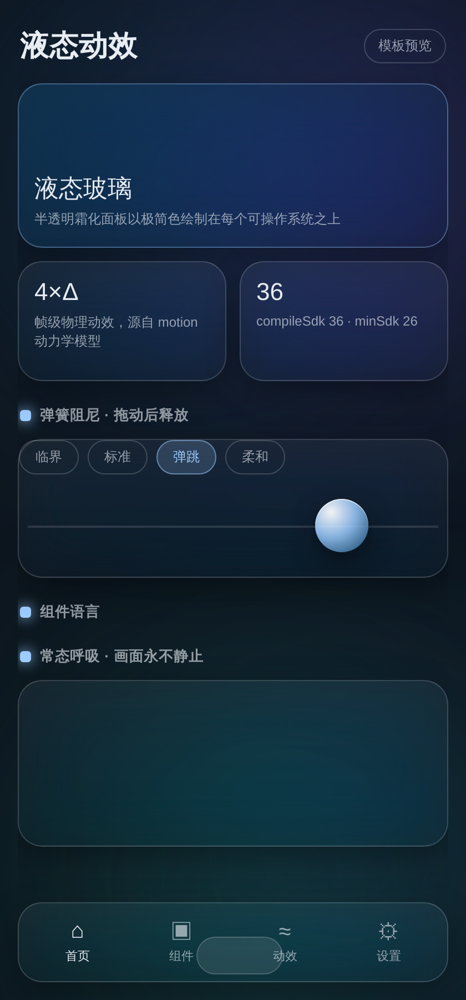
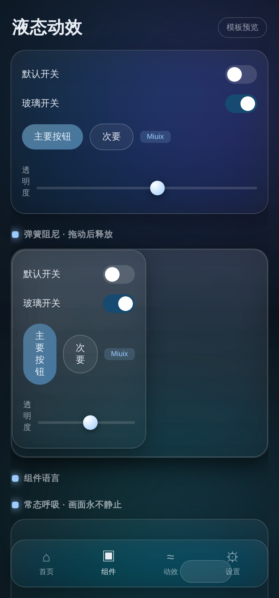
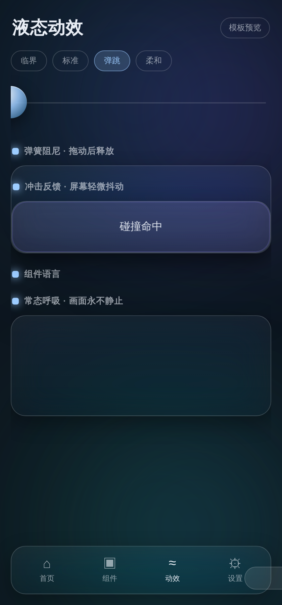
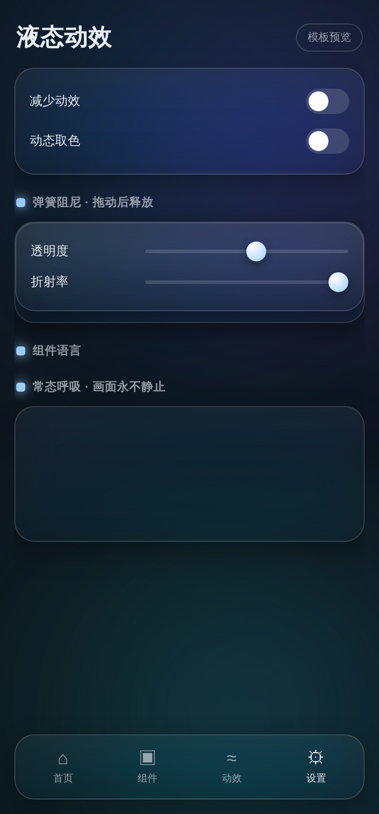
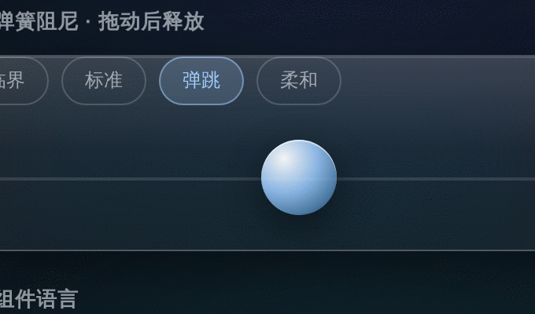

# Liquid Motion UI · Android 液态动效设计模板库

一套可以直接构建出 APK 的 Android Jetpack Compose UI 模板。视觉与组件语言源自
[`kd64i/dyparse`](https://github.com/kd64i/dyparse)（液态玻璃 + Miuix 风格），
动效 token 与物理交互遵循 [`feitangyuan/motion-web`](https://github.com/feitangyuan/motion-web)
的 motion 设计系统，将帧级手感动效（弹簧阻尼、错峰入场、冲击抖动、常态呼吸）移植为
Compose 原生实现。

## 预览

| 首页 / 液态玻璃 | 组件语言 | 动效实验室 | 设置页 |
|---|---|---|---|
|  |  |  |  |

弹簧阻尼回弹（错峰入场的实测帧序列，GIF）：



## v1.1 · 更新内容

依据真机反馈新增（对应实现均可在设置页操作）：

- **液态玻璃总开关**：设置页「液态玻璃风格」一键切回普通 Material 布局（实心卡片 + 标准底栏 + 无折射）。
- **四套主题配色**：冰蓝 / 薄荷 / 落日 / 素灰，设置页色卡即点即换，`Theme.kt` 的 `PaletteSeeds` 一处维护。
- **真玻璃弹窗**：弹窗改为与页面同窗渲染，幕帘层参与折射采样，弹窗卡片真实霜化、折射而非半透明色块。
- **桌面壁纸背景**：设置页开关，直接以手机桌面壁纸作为玻璃折射的背景层。
- **弹簧选择立即回弹**：动效实验室点选预设即触发一段该阻尼的回弹演示，效果即刻可见。
- **全局动效阻尼滑块**：一个滑块重调全应用弹簧阻尼（token 级倍率），越低越弹。
- **开关组件可见性**：轨道放大、加描边与阴影，明暗两态区分更清晰。
- **设计参考署名**：设置页「关于」列出参考仓库 dyparse / Miuix / motion 与地址。

## 这是什么

`/workspace/android` 是一个完整、可编译、可运行的 Android 模板工程：

- **空白功能体验 APK**：开箱即用，四个页面（首页 / 组件 / 动效 / 设置），
  全部内置液态玻璃背景 + 核心动效演示，可直接装到真机体验"手感"。
- **可换肤的设计系统**：色彩、圆角、字体、玻璃透明度、折射率、圆角缩放全部集中为 token，
  改 `Color.kt` 一个文件即可整体换肤。
- **动效系统**：所有动效读取 `Motion.kt` 的 token，无临时 `spring(...)` 魔法数。
- **减少动效**：设置页可一键切换，物理动画降级为临界阻尼、内容默认处于终态。

## 目录结构

```
android/
  app/src/main/java/com/monkeycode/liquidui/
    MainActivity.kt                 # 入口，edge-to-edge
    ui/theme/                       # token：Color / Type / Shape / Theme
    ui/motion/                      # 动效：Motion / Modifiers / DampedDrag / InteractiveHighlight
    ui/components/                  # 组件：Glass / LiquidBottomTabs / Controls / Rows / ...
    ui/screens/                     # 页面：Home / Components / Motion / Settings
    ui/navigation/                  # AppRoot + 底部标签导航
  gradle/libs.versions.toml         # 版本目录
web-preview/index.html              # 纯静态 Web 交互预览（无依赖）
preview/                            # 截图与 GIF
dist/                               # 构建产物（APK、源码 zip）
docs/                               # 详细文档
.github/workflows/                  # CI：推送后自动构建 debug APK
HANDOVER.md                         # 项目交接文档
```

## 文档

- `HANDOVER.md` — 项目交接文档（环境、构建、镜像、已知坑、推送状态）
- `docs/DESIGN_SYSTEM.md` — 设计系统：token、组件目录、玻璃实现原理
- `docs/MOTION_SYSTEM.md` — 动效系统：token 换算、手势物理、减少动效降级
- `docs/TEMPLATE_GUIDE.md` — 如何配置与套用在你的业务项目上
- `docs/BUILD_AND_RELEASE.md` — 构建、签名、发布 APK

## 可直接体验

1. 安装 `dist/liquid-ui-template-debug.apk` 到 Android 8.0+（minSdk 26）设备。
2. 或在浏览器打开 `web-preview/index.html` 预览交互动效。

## 技术栈

| 项 | 版本 |
|---|---|
| Jetpack Compose / Material 3 | BOM 2024.10.01 |
| Kotlin | 2.3.10 |
| AGP | 8.7.3 |
| compileSdk / minSdk / targetSdk | 36 / 26 / 35 |
| Gradle | 8.11.1 |

> 玻璃层使用与参考项目 dyparse 同款的 `io.github.kyant0:backdrop-android`
> （真 backdrop blur + lens 折射，非自绘 tint 模拟），实现原理见
> `docs/DESIGN_SYSTEM.md`。